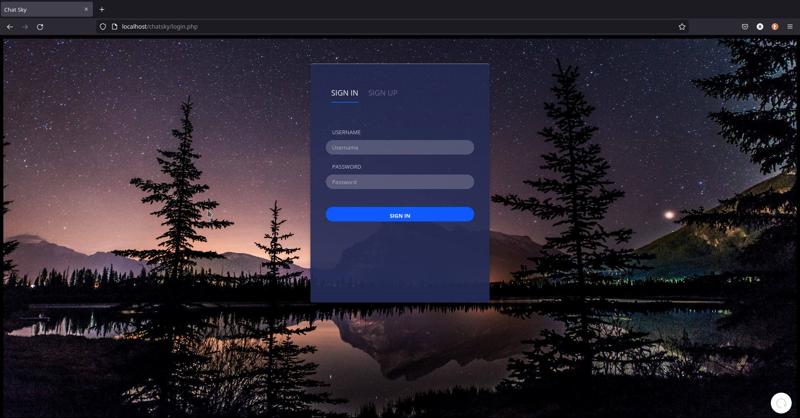
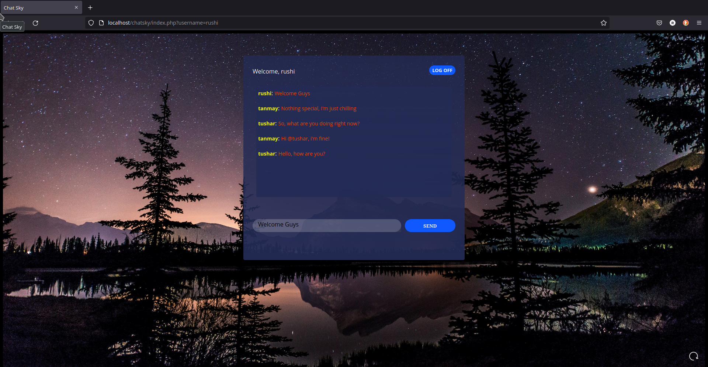

# Chat Sky
## An easy to use public chatroom

<hr />

### Login

<div>
    
</div>

### Chatroom

<div>
    
</div>

<hr />


### Features

 - Login and signup
 - Public chatting
 - User authentication

<hr />

### Technologies used

- HTML, CSS, Javascript
- LAMP Stack

<hr />

### Requirements

- Apache2 (pref 2.4)
- MySQL Server (pref 8.0)

<hr />

### How to setup a chatroom
- Make sure you have the LAMP stack installed.
- See how to setup LAMP stack on Ubuntu [here](https://www.digitalocean.com/community/tutorials/how-to-install-linux-apache-mysql-php-lamp-stack-on-ubuntu-20-04).

1. Clone this repository.
```console
foo@bar:~$ git clone https://github.com/RRkundkar777/chatsky.git
```
2. copy the folder and its contents into <b><i>/var/www/html</i></b> folder of apache
```console
foo@bar:~$ sudo cp chatsky /var/www/html/ -r 
```

3. Start the MySQL Shell 
```console
foo@bar:~$ mysql -p
```

4. Run SQL script included in this repository
```console
mysql> source /var/www/html/chatsky/db/chatsky.sql
```

5. Open your favourite browser and type ```localhost/chatsky``` 

6. If everything works fine, you will land on the login page of ```chatsky!```

<hr />

### Developed by
[Rushikesh Kundkar](https://github.com/RRkundkar777) <br>

### Status
